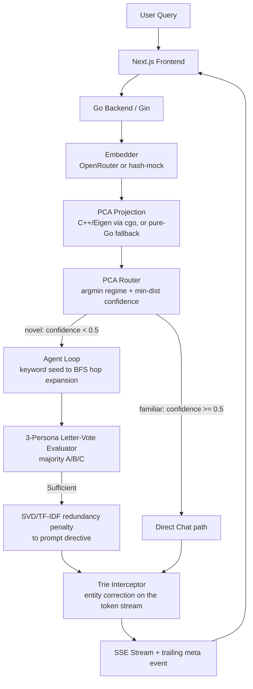

# spectra-rag

> A hybrid RAG system that reimplements pro-tier LLM controls **outside** the model — PCA-based routing, an ensemble confidence vote, a trie stream-corrector, and an SVD redundancy penalty — to work around the limits of free-tier LLM APIs (no `logit_bias`, no `logprobs`, no `frequency_penalty`).

[](https://github.com/navy1999/spectra-rag/actions/workflows/ci.yml)
[](https://go.dev)
[](https://nextjs.org)
[](https://openrouter.ai)
[](LICENSE)

A free LLM endpoint gives you a text stream and nothing else — no token biasing, no
log-probabilities, no repetition penalty. spectra-rag is an exploration of how far you
can recover those capabilities from the outside, in application code, spanning a
**Next.js → Go/Gin → C++ (cgo)** stack with a GraphRAG retrieval layer.

## Architecture



## The four algorithms

Each one substitutes for an LLM API feature the free tier withholds.

| # | Algorithm | Stands in for | File |
|---|-----------|---------------|------|
| 1 | **Dynamic Subspace Router** — project the query embedding to 2D and extract two independent signals: the *nearest* centroid (argmin → regime, sets base temperature) and the *distance* to it (→ confidence; novel queries trigger agentic retrieval + a temperature boost) | manual temperature + routing policy | [`router/pca_router.go`](backend/router/pca_router.go) |
| 2 | **Trie Stream Interceptor** — buffer the token stream to word boundaries and rewrite near-miss entities (Levenshtein) to canonical graph names | `logit_bias` | [`trie/interceptor.go`](backend/trie/interceptor.go) |
| 3 | **SVD Redundancy Penalty** — TF-IDF the retrieved context, take the first singular value's variance ratio, translate it into a "be concise" prompt directive | `frequency_penalty` | [`synthesis/synthesizer.go`](backend/synthesis/synthesizer.go) |
| 4 | **Letter-Vote Evaluator** — 3 LLM personas at distinct temperatures each vote A/B/C (`max_tokens=1`) on context sufficiency; majority gates each retrieval hop | `logprobs` / confidence | [`agent/evaluator.go`](backend/agent/evaluator.go) |

## Live pipeline inspector

The UI doesn't just chat — it shows the machinery. A pipeline panel beside the chat renders, per query:

- a **2D map of the PCA routing space**: the learned regime centroids, where your query landed, and a line to the winning centroid;
- the **stage flow** (embed → route → retrieve → synthesize → guard → stream) lighting up live, each stage annotated with its real values — regime + confidence, hops + chunks retrieved, the SVD redundancy score, entity corrections, and end-to-end latency;
- which of the four algorithms ran at each stage.

Every value is computed server-side in Go and delivered in-band over SSE (a leading `route` event with the decision, a trailing `meta` event with the post-stream metrics). In `MOCK_LLM=true` mode the whole pipeline still runs for real — only the final LLM answer is canned — so the inspector works without an API key.

## Implementation status (what's real vs. prototype)

This is a demonstrator, not a production system. Honest status of each piece:

| Component | Status | Notes |
|-----------|--------|-------|
| GraphRAG retrieval | ✅ Working | Keyword-scored seeding + BFS hop expansion over the knowledge graph |
| PCA Router (Alg 1) | ✅ Working | Dual-signal: argmin centroid → regime/base-temp, min-distance → confidence/path. Real Eigen PCA through cgo (`-tags cgo_pca` + a fitted model); the default fallback is a random-projection sketch (dev stub, not PCA) |
| Trie Interceptor (Alg 2) | ✅ Working | Per-word, ASCII-oriented; corrects single-word near-misses, not multi-word phrase boundaries |
| SVD Penalty (Alg 3) | ✅ Working (heuristic) | Free models reject a `frequency_penalty` param, so the scalar becomes a natural-language synthesis directive rather than a logit-level penalty |
| Letter-Vote Evaluator (Alg 4) | ✅ Working | Requires a live `OPENROUTER_API_KEY`; the three voters use distinct personas + temperatures so they can actually disagree |
| Embeddings | ⚠️ Partial | Real OpenRouter embeddings when a key is set; deterministic hash-based mock otherwise (so routing still runs offline) |
| Knowledge graph | 📦 Demo-scale | 17 curated nodes (5 papers, 5 authors, 4 topics, 3 institutions); the Python ingestion pipeline can regenerate and expand it |

## Benchmarks

Pure-Go algorithm micro-benchmarks (no network), `go test -bench`. Machine: Intel i7-1165G7, Go 1.25, windows/amd64.

| Operation | Time/op | Allocs/op |
|-----------|---------|-----------|
| Keyword seed match (17-node graph) | ~25 µs | 78 |
| BFS 3-hop expansion | ~1.9 µs | 5 |
| PCA route (project + argmin centroid + policy) | ~0.7 µs | 1 |
| SVD redundancy penalty (5 chunks) | ~109 µs | 108 |
| Trie interceptor (build vocab + stream a 35-word paragraph) | ~227 µs | 734 |

Reproduce with `cd backend && go test -bench=. -benchmem ./...`.

## Quick start (Docker, no API key needed)

```bash
git clone https://github.com/navy1999/spectra-rag
cd spectra-rag
MOCK_LLM=true docker compose up --build
# open http://localhost:3000
```

`MOCK_LLM=true` streams a canned response and exercises the full SSE/routing/UI path without any LLM key.

## With a real model

```bash
OPENROUTER_API_KEY=sk-or-v1-... docker compose up --build
```

The default model is `openai/gpt-oss-120b:free`, overridable with `DEFAULT_MODEL`. Get a free key at [openrouter.ai](https://openrouter.ai/keys).

## Local development

```bash
# Backend (go.mod lives in backend/)
cd backend
go run .                          # MOCK_LLM defaults to false; set a key for real output
MOCK_LLM=true go run .            # synthetic streaming, no key

# Frontend
cd frontend
npm install
cp .env.local.example .env.local  # BACKEND_URL=http://localhost:8080
npm run dev
```

## Testing

```bash
cd backend && go test ./...       # unit tests across all packages
go vet ./... && gofmt -l .        # vet + format check (CI gates on both)

cd ../pca_engine
cmake -B build && cmake --build build && ctest --test-dir build
```

CI (`.github/workflows/ci.yml`) runs the Go suite (with `-race`), the Next.js build, and the C++ `ctest` on every push and PR.

## Building the C++ PCA engine (optional)

Without this, the backend uses a pure-Go projection. With it, routing uses real PCA via Eigen.

```bash
cd pca_engine
cmake -B build -DCMAKE_BUILD_TYPE=Release   # Eigen + nlohmann/json fetched automatically
cmake --build build
cd ../backend
go build -tags cgo_pca .                     # link the engine; loads data/pca_model.json at startup
```

## Ingestion pipeline (optional)

Regenerates the knowledge graph and PCA model from arXiv. The backend ships with a prebuilt `data/graph.json`, so this is only needed to change the corpus.

```bash
cd scripts
pip install -r requirements.txt
python ingest.py              # fetch_arxiv.py -> build_graph.py -> fit_pca.py
python ingest.py --skip-fetch # reuse existing data/papers.json
```

## Bring your own graph

The corpus is pluggable — the shipped 17-node graph is just a demo seed. The graph schema ([`data/graph.example.json`](data/graph.example.json)) is a flat `{nodes, edges}` document; node `type` is freeform, so you can model any domain:

```json
{
  "nodes": [
    {"id": "r1", "type": "recipe", "name": "Carbonara", "props": {"minutes": 20}},
    {"id": "i1", "type": "ingredient", "name": "Guanciale"}
  ],
  "edges": [{"from": "r1", "to": "i1", "rel": "uses"}]
}
```

**Two ways to load your own:**

1. **At startup** — point `GRAPH_PATH` at your file (or mount it into the container):
   ```bash
   GRAPH_PATH=/path/to/my-graph.json go run .
   ```
2. **At runtime** — `POST /ingest` validates the graph and atomically hot-swaps it (and the entity trie) with no restart. Gated by a bearer token and **disabled unless `INGEST_TOKEN` is set**, so public deployments are safe by default:
   ```bash
   INGEST_TOKEN=secret go run .
   curl -X POST localhost:8080/ingest \
     -H "Authorization: Bearer secret" \
     --data @my-graph.json
   # -> {"status":"graph replaced","nodes":2,"edges":1,"types":{...}}
   ```

`GET /graph` reports the active graph's node/edge counts and per-type breakdown. Validation rejects empty graphs, duplicate/empty node ids, empty names, and edges that reference undeclared nodes. Hot-swaps are in-memory (ephemeral); use `GRAPH_PATH` for persistence.

## Deployment (free tier)

The browser only ever talks to the Vercel frontend; its Next.js API route (`/api/chat`) proxies to the Go backend **server-side**, so no browser CORS is involved in the standard path.

**Backend → Railway**
1. Push this repo to GitHub.
2. New Railway project → *Deploy from GitHub repo*. [`railway.json`](railway.json) tells Railway to build [`docker/Dockerfile.backend`](docker/Dockerfile.backend) (a ~15 MB pure-Go, CGO-disabled image).
3. Set variables: `OPENROUTER_API_KEY`, optionally `DEFAULT_MODEL`. `PORT` is injected by Railway and read automatically.
4. Railway health-checks `/health`. Copy the public URL (e.g. `https://spectra-rag.up.railway.app`).

**Frontend → Vercel**
1. New Vercel project → import the same repo.
2. Set **Root Directory = `frontend`** (the Next.js app is a subfolder).
3. Set env var `BACKEND_URL` to your Railway URL.
4. Deploy — Vercel auto-detects Next.js (`output: "standalone"` is already configured).

If you also expose the backend directly to browsers (bypassing the proxy), set `CORS_ALLOWED_ORIGINS` to that origin; `localhost`, `*.vercel.app`, `*.up.railway.app`, and `*.onrender.com` are allowed by default.

## Design notes & limitations

- **Free-tier first**: every algorithm exists because the free LLM tier omits a control surface. The trade-off is that some (Alg 3 especially) are heuristics steering the model in natural language rather than at the logit level.
- **Boots with no dependencies**: `data/graph.json` loads at startup; no Python, database, or C++ build is required to run. The PCA model and real embeddings are progressive enhancements.
- **Demo-scale graph**: retrieval quality is bounded by the 17-node graph. The ideas generalize, but the corpus is intentionally small and curated.
- **Post-stream metrics over SSE**: latency and entity-correction counts arrive in a trailing `meta` event, since HTTP headers are already flushed once token streaming begins.
