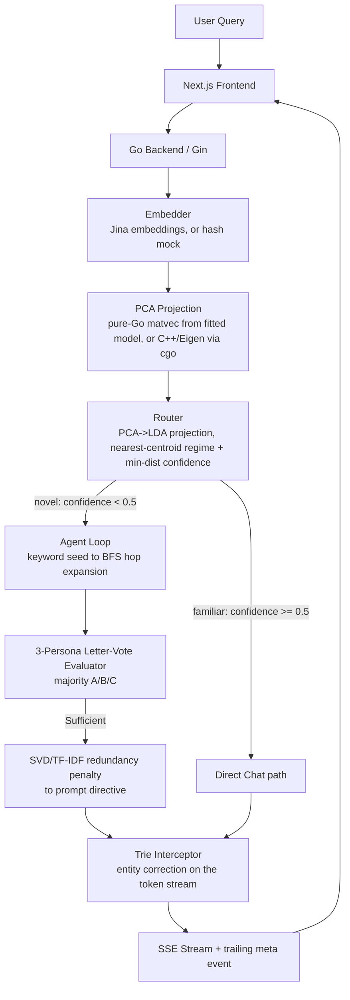
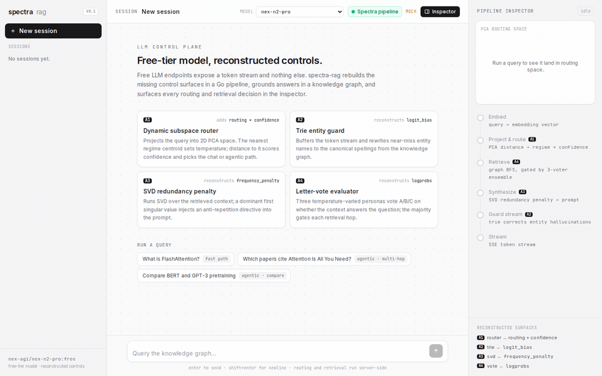

# spectra-rag

> Hybrid RAG system that rebuilds the LLM controls free-tier APIs leave out (`logit_bias`, `logprobs`, `frequency_penalty`) and uses them to get better completions out of small free models.

[](https://github.com/navy1999/spectra-rag/actions/workflows/ci.yml)
[](https://go.dev)
[](https://nextjs.org)
[](https://openrouter.ai)
[](LICENSE)

Free LLM endpoints give you a token stream and not much else: no token biasing, no log-probabilities, no repetition penalty. This project does two things about that. First, it recovers each missing control in application code. Second, it uses those controls to improve answer quality from small free models, the kind that need the most help: answers grounded in a knowledge graph, entity names spelled the way the corpus spells them, and less repetition when the retrieved context is redundant.

The quality improvement is measured: on a 22-question graph-grounded ablation, the spectra layers raise entity exact-spelling to 81.4% (from 73.5% raw / 79.2% plain RAG) and cut repetition. The router is measured too: a supervised PCA→LDA projection routes chat-vs-agentic at 95% in-sample / 85% leave-one-out accuracy, beating every length and count baseline (best baseline 70%). See [Evaluation](#evaluation-phase-1) for the full tables and findings.

The stack is Next.js, Go/Gin, and an optional C++ PCA engine linked over cgo, with GraphRAG-style retrieval over a JSON knowledge graph.

## Architecture



## The four algorithms

Each one substitutes for an LLM API feature the free tier withholds.

| # | Algorithm | Replaces | File |
|---|-----------|----------|------|
| 1 | **Dynamic Subspace Router**: projects the query embedding to 2D and reads two signals from it. The nearest centroid (argmin) gives the regime, which sets the base temperature. The distance to it gives a confidence score; far-out queries trigger agentic retrieval and a temperature boost. | manual temperature and routing policy | [`router/pca_router.go`](backend/router/pca_router.go) |
| 2 | **Trie Stream Interceptor**: buffers the token stream to word boundaries and rewrites near-miss entity names (by Levenshtein distance) to the canonical spellings from the graph. | `logit_bias` | [`trie/interceptor.go`](backend/trie/interceptor.go) |
| 3 | **SVD Redundancy Penalty**: runs TF-IDF and SVD over the retrieved context; the first singular value's variance ratio becomes an anti-repetition instruction in the prompt. | `frequency_penalty` | [`synthesis/synthesizer.go`](backend/synthesis/synthesizer.go) |
| 4 | **Letter-Vote Evaluator**: three LLM personas at different temperatures each vote A/B/C (`max_tokens=1`) on whether the context answers the question; the majority gates each retrieval hop. | `logprobs` / confidence | [`agent/evaluator.go`](backend/agent/evaluator.go) |

## Pipeline inspector



*An agentic query (“Compare BERT and GPT-3 pretraining”) projected into the routing space, routed to the creative regime, expanded one hop over the graph for 2 chunks, and streamed back — with every stage's decision surfaced live. Recorded with `MOCK_LLM=true`, so the full pipeline runs and only the final answer text is synthetic.*

A panel next to the chat shows what happened on each query:

- a 2D map of the routing space, with the regime centroids, the point where the query landed, and a line to the winning centroid
- the stage flow (embed, route, retrieve, synthesize, guard, stream) with the values each stage produced: regime and confidence, hops and chunks retrieved, the redundancy score, entity corrections, and latency
- which of the four algorithms ran at each stage

The values come from the Go backend in-band over SSE: a `route` event before the first token, a `meta` event after the last. With `MOCK_LLM=true` the pipeline still runs end to end and only the final answer is canned, so the inspector works without an API key.

## Implementation status

This is a demonstrator, not a production system. Status of each piece:

| Component | Status | Notes |
|-----------|--------|-------|
| GraphRAG retrieval | Working | Seeds by semantic nearest-neighbor (query embedding vs. precomputed node embeddings) unioned with lexical keyword matches, then BFS hop expansion gated by the vote ensemble; retrieved chunks carry paper abstracts. Falls back to lexical-only seeding without `node_embeddings.json` |
| Router (Alg 1) | Working, supervised | Default model is a fitted **PCA(16)→LDA** projection (`method: pca16_lda`) that separates chat-vs-agentic at 95% in-sample / 85% LOOCV. The argmin centroid gives the regime; in regime-routing mode the nearest class centroid sets the path directly. The pure-Go build does the real matvec (`components·(x−mean)`) from `data/pca_model.json` — no cgo needed; the Eigen/cgo path is an optional fast path. An unsupervised PCA model is kept at `data/pca_model.unsupervised.json` for comparison |
| Trie Interceptor (Alg 2) | Working | Per-word and ASCII-oriented; corrects single-word near-misses, not multi-word phrases |
| SVD Penalty (Alg 3) | Working, heuristic | Free models reject the `frequency_penalty` parameter, so the score becomes a prompt instruction rather than a logit-level penalty |
| Letter-Vote Evaluator (Alg 4) | Working | Needs a live `OPENROUTER_API_KEY`; the voters use different personas and temperatures so they can disagree |
| Embeddings | Real with a key | Jina (`EMBEDDINGS_API_KEY`, default `jina-embeddings-v3`); OpenRouter does not serve embeddings. Without a key it uses a deterministic hash mock for offline boot, and the server logs that routing is non-semantic |
| Knowledge graph | Ingested from arXiv | 282 nodes / 288 edges (50 papers, 220 authors, 7 topics, 5 institutions), built by the Python pipeline from 50 foundational ML/NLP arXiv papers; papers are the well-connected hubs (authored + about edges). Re-runnable to swap or grow the corpus |
| Answer-quality eval | Measured | Phase 1 ablation run on 22 questions: spectra layers raise entity exact-spelling (81.4%) and distinct-2 (0.939) and groundedness (87.5%) over plain RAG. See [Results](#results) |

## Benchmarks

Pure-Go algorithm micro-benchmarks (no network), `go test -bench`. Machine: Intel i7-1165G7, Go 1.25, windows/amd64.

| Operation | Time/op | Allocs/op |
|-----------|---------|-----------|
| Keyword seed match (benchmark fixture graph) | ~25 µs | 78 |
| BFS 3-hop expansion | ~1.9 µs | 5 |
| PCA route (project, argmin, policy) | ~0.7 µs | 1 |
| SVD redundancy penalty (5 chunks) | ~109 µs | 108 |
| Trie interceptor (build vocab, stream a 35-word paragraph) | ~227 µs | 734 |

Reproduce with `cd backend && go test -bench=. -benchmem ./...`.

## Evaluation (Phase 1)

Does the framework actually improve a small model's output? Phase 1 is a controlled ablation: it runs one small model (default `meta-llama/llama-3.2-3b-instruct:free`) under three conditions over a graph-grounded question set, holding the model and retrieved context fixed so the only variable is the spectra layers.

| Condition | Context | Spectra layers |
|---|---|---|
| `raw` | none | none |
| `rag_plain` | retrieved | none |
| `rag_spectra` | retrieved | SVD redundancy directive (A3) + trie entity guard (A2) |

Metrics are judge-free string measures, so there is no "LLM grading an LLM" circularity:

- **Entity-spelling fidelity** (the trie guard, A2): rate at which expected entities appear with their exact canonical spelling vs. as near-misses (`Flash Attention`, `Bert`, `FlashAttension`).
- **Repetition** (the SVD penalty, A3): distinct-2 ratio, higher is less repetitive.
- **Groundedness**: fraction of mentioned graph entities that appear in the retrieved context.

The `rag_spectra` condition reuses the real `synthesis`, `retrieval`, and `trie` packages, not reimplementations. Run it (needs a key; responses are cached, 429s are retried):

```bash
cd backend
OPENROUTER_API_KEY=sk-or-... go run ./cmd/eval            # full set
OPENROUTER_API_KEY=sk-or-... go run ./cmd/eval -limit 5   # quick smoke
```

Results write to `data/eval_results.md`. The metric functions are unit-tested (`go test ./eval/`) and run in CI without a key. Questions live in `data/eval_questions.json` and are meant to be edited. Routing (A1) and the vote evaluator (A4) affect path and retrieval rather than these two metrics and are reported separately.

### Results

A full run on `openai/gpt-oss-20b:free` over the 22-question graph-grounded set (same model and retrieved context across conditions, temperature 0.30, 1-hop BFS). The spectra layers move every metric they target in the intended direction:

| Metric | raw | rag_plain | rag_spectra |
|---|---|---|---|
| Entity exact-spelling rate (higher better) | 73.5% | 79.2% | **81.4%** |
| Entity near-miss rate (lower better) | 14.0% | 15.5% | **11.7%** |
| Entity recall, any form (higher better) | 87.5% | 94.7% | 93.2% |
| Repetition: distinct-2 (higher better) | 0.913 | 0.922 | **0.939** |
| Groundedness, RAG only (higher better) | — | 82.2% | **87.5%** |

**Takeaways.** Retrieval alone (`rag_plain`) lifts entity exact-spelling and recall over the no-context baseline, as expected. Adding the spectra control layers (`rag_spectra`) goes further on the two metrics they are designed for: the **trie entity guard (A2)** pushes exact-spelling to 81.4% while cutting the near-miss rate to 11.7% (below even the raw baseline), and the **SVD redundancy penalty (A3)** raises distinct-2 from 0.922 to 0.939 (less repetition). Groundedness also improves to 87.5%. Entity recall dips slightly versus plain RAG (93.2% vs 94.7%), the expected cost of the guard preferring exact canonical forms over loose near-miss matches. The full per-answer outputs are in `data/eval_results.json`; regenerate with `go run ./cmd/eval`.

### A1 routing evaluation

A separate, judge-free harness asks whether the PCA router's chat-vs-agentic decision beats trivial baselines, over a labeled set (`data/routing_questions.json`). It needs only one embedding per question (no chat LLM), so it's cheap — but the `pca` row is meaningful only with real embeddings + a fitted model (`EMBEDDINGS_API_KEY` set); otherwise it routes on the dev sketch and is flagged.

```bash
cd backend
EMBEDDINGS_API_KEY=jina_... go run ./cmd/routeeval
```

It compares the learned router against `length` (route by query length), `hit_count` (route by graph keyword hits), and the `always_chat`/`always_agentic` baselines, reporting routing accuracy + an agentic-rate cost proxy. A learned router earns its complexity only if it clears those one-liners.

**Result (real Jina embeddings + fitted supervised model, 40-question set):**

| Router | Routing accuracy | Agentic-rate |
|---|---|---|
| `pca16_lda` (supervised) | **95%** | 50% |
| length | 52% | 42% |
| hit_count | 65% | 65% |
| always_agentic | 50% | 100% |
| always_chat | 50% | 0% |

The table above is in-sample (the eval scores on the same labeled set the projection was fit on). The honest generalization estimate is **85% leave-one-out cross-validation** (`scripts/fit_lda.py` reports it on every fit) — still well above the 52% `length` baseline.

**How this got here (the interesting part).** The first version of this eval was a *negative* result, kept here because the path to fixing it is the actual engineering:

1. **Unsupervised PCA lost to a one-liner.** On the original 16-question set, the 2-component PCA router scored 69% and the trivial `length` heuristic scored 75%. PCA maximizes *variance*, which on a homogeneous paper corpus is dominated by topic, not by the chat-vs-agentic distinction the router actually needs.
2. **The dataset was the real bug.** Inspecting it showed every `chat` question had ≤5 words and every `agentic` one had ≥8 — the labels were *perfectly separable by word count*, so no embedding-based router could ever beat `length`; the task was secretly a length task. The set was rebuilt to 40 questions that **decouple intent from length** (long verbose definitional questions labeled `chat`; short terse relational questions labeled `agentic`), dropping the best possible length-threshold accuracy to ~70%.
3. **Supervised, but honestly cross-validated.** A supervised **LDA** projection replaces PCA. Raw LDA on 1024-dim embeddings with ~40 samples overfits completely (in-sample ~100%, leave-one-out ~chance), so the fitter reduces with **PCA→LDA** (k=16, chosen by a leave-one-out sweep) and embeds queries with Jina v3's **`classification` task adapter**. Both stages are linear, so the whole pipeline folds into the same `components·(x−mean)` projection the Go router already runs — **zero runtime changes**, just a different fitted `data/*_model.json`. Final: 95% in-sample / **85% LOOCV**, beating every baseline.

The lesson — *a model can only be as good as the labels let it be, and in-sample accuracy on a supervised model is meaningless without cross-validation* — is the kind of finding that's worth more than a cherry-picked win. Fit it yourself with `EMBEDDINGS_API_KEY=jina_... go run ./cmd/embeddump` then `python scripts/fit_lda.py --embeddings data/routing_embeddings.json`.

## Quick start (Docker, no API key needed)

```bash
git clone https://github.com/navy1999/spectra-rag
cd spectra-rag
MOCK_LLM=true docker compose up --build
# open http://localhost:3000
```

`MOCK_LLM=true` runs the real pipeline with a synthetic answer, so the whole SSE/routing/UI path works without any LLM key.

## With a real model

```bash
OPENROUTER_API_KEY=sk-or-v1-... docker compose up --build
```

The default model is `nex-agi/nex-n2-pro:free`, overridable with `DEFAULT_MODEL`. Get a free key at [openrouter.ai](https://openrouter.ai/keys). Free models churn and are frequently rate-limited upstream, so the backend automatically falls through a list of fallback free models on a `429`; override the list with `FALLBACK_MODELS` (comma-separated). This keeps the live demo answering even when the primary model is throttled.

## Local development

```bash
# Backend (go.mod lives in backend/)
cd backend
go run .                          # set a key for real output
MOCK_LLM=true go run .            # synthetic streaming, no key

# Frontend
cd frontend
npm install
cp .env.local.example .env.local  # BACKEND_URL=http://localhost:8080
npm run dev
```

## Testing

```bash
cd backend && go test ./...       # unit tests across all packages
go vet ./... && gofmt -l .        # vet and format check (CI gates on both)

cd ../pca_engine
cmake -B build && cmake --build build && ctest --test-dir build
```

CI (`.github/workflows/ci.yml`) runs the Go suite (with `-race`), the Next.js build, and the C++ `ctest` on every push and PR.

## Making the router real (embeddings + fitted model)

The router only carries a real signal when two things are true: queries are turned into **real embeddings**, and they're projected through a **fitted model of the same dimension**. Otherwise the backend logs a warning and routes on a non-semantic dev sketch.

1. **Embeddings** — set an embeddings key (OpenRouter does not serve embeddings; Jina's free tier is the default):
   ```bash
   EMBEDDINGS_API_KEY=jina_...          # required for a real signal
   EMBEDDINGS_BASE_URL=https://api.jina.ai/v1   # default
   EMBEDDINGS_MODEL=jina-embeddings-v3          # default (1024-d)
   EMBEDDINGS_TASK=classification               # default; Jina v3 task adapter that sharpens chat-vs-agentic separation
   ```
   The `EMBEDDINGS_TASK` adapter matters: switching Jina v3 to its `classification` task adapter is what lifts the routing signal from near-baseline to the 85% LOOCV result. The query embedding is computed once and reused for both routing and **semantic seed retrieval** (cosine NN against node embeddings), so `embed_nodes.py` must use the *same* task — see step 3.
2. **Fitted model** — the default `data/pca_model.json` is a supervised **PCA(16)→LDA** projection. To refit it from labeled routing questions:
   ```bash
   cd backend && EMBEDDINGS_API_KEY=jina_... \
     go run ./cmd/embeddump -task classification \
       -in ../data/routing_questions.json -out ../data/routing_embeddings.json
   # embeds the labeled set once via the Go embedder (avoids Python TLS issues), then:
   cd .. && pip install -r scripts/requirements.txt
   python scripts/fit_lda.py --embeddings data/routing_embeddings.json
   # writes data/pca_model.json + pca_centroids.json (method: pca16_lda),
   # reports in-sample and leave-one-out CV accuracy
   ```
   To regenerate the older unsupervised PCA model instead: `EMBEDDINGS_API_KEY=jina_... python scripts/fit_pca.py`.
3. **Node embeddings (semantic retrieval)** — embed every graph node so retrieval seeds by meaning, not just keywords. Use the **same** `EMBEDDINGS_TASK` as the backend so the reused query vector shares the node space:
   ```bash
   EMBEDDINGS_API_KEY=jina_... EMBEDDINGS_TASK=classification \
     python scripts/embed_nodes.py        # writes data/node_embeddings.json
   ```
   Commit `data/node_embeddings.json` so the deployed backend gets semantic seeding; without it, seeding falls back to lexical keyword matching.
4. **Deploy** — set `EMBEDDINGS_API_KEY` (and matching `EMBEDDINGS_TASK`) on the backend host (e.g. Railway) so runtime embeddings match the fitted model and node embeddings.
5. **Evaluate** — score the router against length/count baselines:
   ```bash
   cd backend && EMBEDDINGS_API_KEY=jina_... go run ./cmd/routeeval
   ```

The projection is a plain `components·(x−mean)` matrix multiply in pure Go, so no cgo is required — a `CGO_ENABLED=0` image (the Railway default) does real PCA. The C++/Eigen engine below is an optional faster path, not a requirement.

### C++ PCA engine (optional fast path)

```bash
cd pca_engine
cmake -B build -DCMAKE_BUILD_TYPE=Release   # Eigen and nlohmann/json fetched automatically
cmake --build build
cd ../backend
go build -tags cgo_pca .                     # links the Eigen engine instead of the pure-Go projection
```

## Ingestion pipeline (optional)

Regenerates the knowledge graph and PCA model from arXiv. The backend ships with a prebuilt `data/graph.json`, so this is only needed to change the corpus.

```bash
cd scripts
pip install -r requirements.txt
python ingest.py              # fetch_arxiv.py, then build_graph.py, then fit_pca.py
python ingest.py --skip-fetch # reuse existing data/papers.json
```

## Bring your own graph

The corpus is pluggable; the shipped 282-node graph is built from arXiv but easy to replace. The graph schema ([`data/graph.example.json`](data/graph.example.json)) is a flat `{nodes, edges}` document, and node `type` is freeform, so you can model any domain:

```json
{
  "nodes": [
    {"id": "r1", "type": "recipe", "name": "Carbonara", "props": {"minutes": 20}},
    {"id": "i1", "type": "ingredient", "name": "Guanciale"}
  ],
  "edges": [{"from": "r1", "to": "i1", "rel": "uses"}]
}
```

Two ways to load your own:

1. At startup, point `GRAPH_PATH` at your file (or mount it into the container):
   ```bash
   GRAPH_PATH=/path/to/my-graph.json go run .
   ```
2. At runtime, `POST /ingest` validates the graph and atomically hot-swaps it (and the entity trie) with no restart. It is gated by a bearer token and disabled unless `INGEST_TOKEN` is set, so public deployments are safe by default:
   ```bash
   INGEST_TOKEN=secret go run .
   curl -X POST localhost:8080/ingest \
     -H "Authorization: Bearer secret" \
     --data @my-graph.json
   # -> {"status":"graph replaced","nodes":2,"edges":1,"types":{...}}
   ```

`GET /graph` reports the active graph's node and edge counts with a per-type breakdown. Validation rejects empty graphs, duplicate or empty node ids, empty names, and edges that reference undeclared nodes. Hot-swaps are in-memory; use `GRAPH_PATH` for persistence.

## Deployment

The frontend and backend deploy separately. The browser talks only to the Next.js app, whose `/api/chat` route proxies to the Go backend server-side, so the standard path needs no CORS setup.

- Backend: [`railway.json`](railway.json) builds [`docker/Dockerfile.backend`](docker/Dockerfile.backend) (a small pure-Go image) with a `/health` healthcheck. Set `OPENROUTER_API_KEY`, and optionally `DEFAULT_MODEL` and `INGEST_TOKEN`. Any container host works the same way.
- Frontend: a standard Next.js app (`output: "standalone"`). On Vercel, set the project root to `frontend/` and point `BACKEND_URL` at the backend URL.

If you expose the backend directly to browsers, set `CORS_ALLOWED_ORIGINS` to that origin. `localhost`, `*.vercel.app`, `*.up.railway.app`, and `*.onrender.com` are allowed by default.

## Design notes and limitations

- Free-tier first: every algorithm exists because the free tier omits a control. Some are heuristics. Algorithm 3 in particular steers the model with natural language rather than at the logit level.
- Boots with no dependencies: `data/graph.json` loads at startup. No Python, database, or C++ build is needed to run; the PCA model and real embeddings are optional upgrades.
- Bounded corpus: retrieval quality is bounded by the 282-node graph of 50 foundational papers. The graph is also author-heavy (most authors connect to a single paper), so cross-paper reasoning rests mainly on shared topics; broadening it means ingesting more papers and richer relation extraction.
- Post-stream metrics ride the SSE stream: latency and correction counts arrive in a trailing `meta` event, since headers are already flushed once streaming starts.
