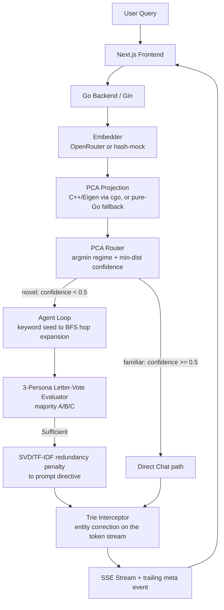

# spectra-rag

> Hybrid RAG system that rebuilds the LLM controls free-tier APIs leave out (`logit_bias`, `logprobs`, `frequency_penalty`) and uses them to get better completions out of small free models.

[](https://github.com/navy1999/spectra-rag/actions/workflows/ci.yml)
[](https://go.dev)
[](https://nextjs.org)
[](https://openrouter.ai)
[](LICENSE)

Free LLM endpoints give you a token stream and not much else: no token biasing, no log-probabilities, no repetition penalty. This project does two things about that. First, it recovers each missing control in application code. Second, it uses those controls to improve answer quality from small free models, the kind that need the most help: answers grounded in a knowledge graph, entity names spelled the way the corpus spells them, and less repetition when the retrieved context is redundant.

The quality improvement is the design goal, not yet a measured result. The benchmarks below cover algorithm speed; a labeled evaluation set for answer quality is on the roadmap.

The stack is Next.js, Go/Gin, and an optional C++ PCA engine linked over cgo, with GraphRAG-style retrieval over a JSON knowledge graph.

## Architecture



## The four algorithms

Each one substitutes for an LLM API feature the free tier withholds.

| # | Algorithm | Replaces | File |
|---|-----------|----------|------|
| 1 | **Dynamic Subspace Router**: projects the query embedding to 2D and reads two signals from it. The nearest centroid (argmin) gives the regime, which sets the base temperature. The distance to it gives a confidence score; far-out queries trigger agentic retrieval and a temperature boost. | manual temperature and routing policy | [`router/pca_router.go`](backend/router/pca_router.go) |
| 2 | **Trie Stream Interceptor**: buffers the token stream to word boundaries and rewrites near-miss entity names (by Levenshtein distance) to the canonical spellings from the graph. | `logit_bias` | [`trie/interceptor.go`](backend/trie/interceptor.go) |
| 3 | **SVD Redundancy Penalty**: runs TF-IDF and SVD over the retrieved context; the first singular value's variance ratio becomes an anti-repetition instruction in the prompt. | `frequency_penalty` | [`synthesis/synthesizer.go`](backend/synthesis/synthesizer.go) |
| 4 | **Letter-Vote Evaluator**: three LLM personas at different temperatures each vote A/B/C (`max_tokens=1`) on whether the context answers the question; the majority gates each retrieval hop. | `logprobs` / confidence | [`agent/evaluator.go`](backend/agent/evaluator.go) |

## Pipeline inspector

A panel next to the chat shows what happened on each query:

- a 2D map of the routing space, with the regime centroids, the point where the query landed, and a line to the winning centroid
- the stage flow (embed, route, retrieve, synthesize, guard, stream) with the values each stage produced: regime and confidence, hops and chunks retrieved, the redundancy score, entity corrections, and latency
- which of the four algorithms ran at each stage

The values come from the Go backend in-band over SSE: a `route` event before the first token, a `meta` event after the last. With `MOCK_LLM=true` the pipeline still runs end to end and only the final answer is canned, so the inspector works without an API key.

## Implementation status

This is a demonstrator, not a production system. Status of each piece:

| Component | Status | Notes |
|-----------|--------|-------|
| GraphRAG retrieval | Working | Keyword-scored seeding plus BFS hop expansion over the knowledge graph |
| PCA Router (Alg 1) | Working | Argmin centroid gives regime and base temperature, distance gives confidence and path. Real Eigen PCA with `-tags cgo_pca` and a fitted model; the default fallback is a random-projection stub, not PCA |
| Trie Interceptor (Alg 2) | Working | Per-word and ASCII-oriented; corrects single-word near-misses, not multi-word phrases |
| SVD Penalty (Alg 3) | Working, heuristic | Free models reject the `frequency_penalty` parameter, so the score becomes a prompt instruction rather than a logit-level penalty |
| Letter-Vote Evaluator (Alg 4) | Working | Needs a live `OPENROUTER_API_KEY`; the voters use different personas and temperatures so they can disagree |
| Embeddings | Partial | Real OpenRouter embeddings with a key; deterministic hash-based mock without one, so routing still runs offline |
| Knowledge graph | Demo scale | 17 curated nodes (5 papers, 5 authors, 4 topics, 3 institutions); the Python pipeline can regenerate and expand it |
| Answer-quality eval | Harness shipped | Phase 1 ablation (see Evaluation) measures entity fidelity and repetition across conditions; run it with a key to populate `data/eval_results.md` |

## Benchmarks

Pure-Go algorithm micro-benchmarks (no network), `go test -bench`. Machine: Intel i7-1165G7, Go 1.25, windows/amd64.

| Operation | Time/op | Allocs/op |
|-----------|---------|-----------|
| Keyword seed match (17-node graph) | ~25 µs | 78 |
| BFS 3-hop expansion | ~1.9 µs | 5 |
| PCA route (project, argmin, policy) | ~0.7 µs | 1 |
| SVD redundancy penalty (5 chunks) | ~109 µs | 108 |
| Trie interceptor (build vocab, stream a 35-word paragraph) | ~227 µs | 734 |

Reproduce with `cd backend && go test -bench=. -benchmem ./...`.

## Evaluation (Phase 1)

Does the framework actually improve a small model's output? Phase 1 is a controlled ablation: it runs one small model (default `meta-llama/llama-3.2-3b-instruct:free`) under three conditions over a graph-grounded question set, holding the model and retrieved context fixed so the only variable is the spectra layers.

| Condition | Context | Spectra layers |
|---|---|---|
| `raw` | none | none |
| `rag_plain` | retrieved | none |
| `rag_spectra` | retrieved | SVD redundancy directive (A3) + trie entity guard (A2) |

Metrics are judge-free string measures, so there is no "LLM grading an LLM" circularity:

- **Entity-spelling fidelity** (the trie guard, A2): rate at which expected entities appear with their exact canonical spelling vs. as near-misses (`Flash Attention`, `Bert`, `FlashAttension`).
- **Repetition** (the SVD penalty, A3): distinct-2 ratio, higher is less repetitive.
- **Groundedness**: fraction of mentioned graph entities that appear in the retrieved context.

The `rag_spectra` condition reuses the real `synthesis`, `retrieval`, and `trie` packages, not reimplementations. Run it (needs a key; responses are cached, 429s are retried):

```bash
cd backend
OPENROUTER_API_KEY=sk-or-... go run ./cmd/eval            # full set
OPENROUTER_API_KEY=sk-or-... go run ./cmd/eval -limit 5   # quick smoke
```

Results write to `data/eval_results.md`. The metric functions are unit-tested (`go test ./eval/`) and run in CI without a key. Questions live in `data/eval_questions.json` and are meant to be edited. Routing (A1) and the vote evaluator (A4) affect path and retrieval rather than these two metrics and are reported separately.

## Quick start (Docker, no API key needed)

```bash
git clone https://github.com/navy1999/spectra-rag
cd spectra-rag
MOCK_LLM=true docker compose up --build
# open http://localhost:3000
```

`MOCK_LLM=true` runs the real pipeline with a synthetic answer, so the whole SSE/routing/UI path works without any LLM key.

## With a real model

```bash
OPENROUTER_API_KEY=sk-or-v1-... docker compose up --build
```

The default model is `openai/gpt-oss-120b:free`, overridable with `DEFAULT_MODEL`. Get a free key at [openrouter.ai](https://openrouter.ai/keys).

## Local development

```bash
# Backend (go.mod lives in backend/)
cd backend
go run .                          # set a key for real output
MOCK_LLM=true go run .            # synthetic streaming, no key

# Frontend
cd frontend
npm install
cp .env.local.example .env.local  # BACKEND_URL=http://localhost:8080
npm run dev
```

## Testing

```bash
cd backend && go test ./...       # unit tests across all packages
go vet ./... && gofmt -l .        # vet and format check (CI gates on both)

cd ../pca_engine
cmake -B build && cmake --build build && ctest --test-dir build
```

CI (`.github/workflows/ci.yml`) runs the Go suite (with `-race`), the Next.js build, and the C++ `ctest` on every push and PR.

## Building the C++ PCA engine (optional)

Without this, the backend uses a pure-Go projection stub. With it, routing uses real PCA via Eigen.

```bash
cd pca_engine
cmake -B build -DCMAKE_BUILD_TYPE=Release   # Eigen and nlohmann/json fetched automatically
cmake --build build
cd ../backend
go build -tags cgo_pca .                     # links the engine; loads data/pca_model.json at startup
```

## Ingestion pipeline (optional)

Regenerates the knowledge graph and PCA model from arXiv. The backend ships with a prebuilt `data/graph.json`, so this is only needed to change the corpus.

```bash
cd scripts
pip install -r requirements.txt
python ingest.py              # fetch_arxiv.py, then build_graph.py, then fit_pca.py
python ingest.py --skip-fetch # reuse existing data/papers.json
```

## Bring your own graph

The corpus is pluggable; the shipped 17-node graph is a demo seed. The graph schema ([`data/graph.example.json`](data/graph.example.json)) is a flat `{nodes, edges}` document, and node `type` is freeform, so you can model any domain:

```json
{
  "nodes": [
    {"id": "r1", "type": "recipe", "name": "Carbonara", "props": {"minutes": 20}},
    {"id": "i1", "type": "ingredient", "name": "Guanciale"}
  ],
  "edges": [{"from": "r1", "to": "i1", "rel": "uses"}]
}
```

Two ways to load your own:

1. At startup, point `GRAPH_PATH` at your file (or mount it into the container):
   ```bash
   GRAPH_PATH=/path/to/my-graph.json go run .
   ```
2. At runtime, `POST /ingest` validates the graph and atomically hot-swaps it (and the entity trie) with no restart. It is gated by a bearer token and disabled unless `INGEST_TOKEN` is set, so public deployments are safe by default:
   ```bash
   INGEST_TOKEN=secret go run .
   curl -X POST localhost:8080/ingest \
     -H "Authorization: Bearer secret" \
     --data @my-graph.json
   # -> {"status":"graph replaced","nodes":2,"edges":1,"types":{...}}
   ```

`GET /graph` reports the active graph's node and edge counts with a per-type breakdown. Validation rejects empty graphs, duplicate or empty node ids, empty names, and edges that reference undeclared nodes. Hot-swaps are in-memory; use `GRAPH_PATH` for persistence.

## Deployment

The frontend and backend deploy separately. The browser talks only to the Next.js app, whose `/api/chat` route proxies to the Go backend server-side, so the standard path needs no CORS setup.

- Backend: [`railway.json`](railway.json) builds [`docker/Dockerfile.backend`](docker/Dockerfile.backend) (a small pure-Go image) with a `/health` healthcheck. Set `OPENROUTER_API_KEY`, and optionally `DEFAULT_MODEL` and `INGEST_TOKEN`. Any container host works the same way.
- Frontend: a standard Next.js app (`output: "standalone"`). On Vercel, set the project root to `frontend/` and point `BACKEND_URL` at the backend URL.

If you expose the backend directly to browsers, set `CORS_ALLOWED_ORIGINS` to that origin. `localhost`, `*.vercel.app`, `*.up.railway.app`, and `*.onrender.com` are allowed by default.

## Design notes and limitations

- Free-tier first: every algorithm exists because the free tier omits a control. Some are heuristics. Algorithm 3 in particular steers the model with natural language rather than at the logit level.
- Boots with no dependencies: `data/graph.json` loads at startup. No Python, database, or C++ build is needed to run; the PCA model and real embeddings are optional upgrades.
- Demo-scale graph: retrieval quality is bounded by the 17-node graph. The ideas generalize, but the corpus is small on purpose.
- Post-stream metrics ride the SSE stream: latency and correction counts arrive in a trailing `meta` event, since headers are already flushed once streaming starts.
