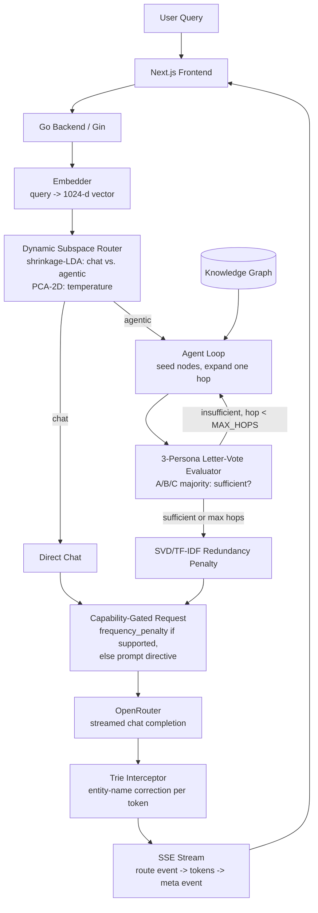
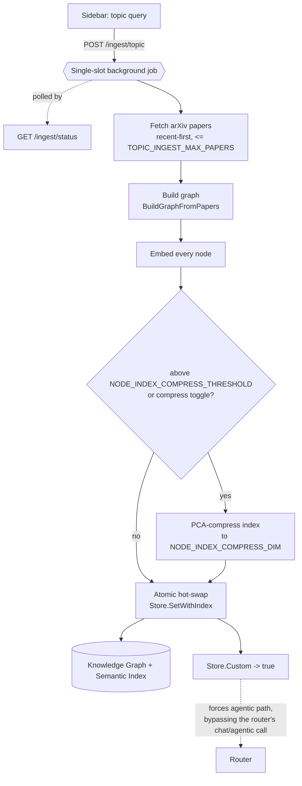

# spectra-rag

> A hybrid GraphRAG system for small free-tier LLMs that detects which sampling controls each model exposes, uses native controls when available, reconstructs missing ones in application code, and measures whether each one actually improves output quality.

[
[
[
[
[

Free LLM endpoints expose an inconsistent subset of sampling controls. Some models accept `frequency_penalty`, `top_p`, and `presence_penalty`; few accept `logit_bias`; almost none return `logprobs`. spectra-rag reads each model's `supported_parameters` from OpenRouter, sends native controls where available, reconstructs missing behavior in application code, and evaluates which controls produce measurable gains on small models.

## What it shows

- **Routing works.** A supervised shrinkage-LDA classifier routes chat vs agentic queries at **97.5% leave-one-out**, permutation-confirmed, and beats length and keyword baselines.
- **Retrieval helps when the model lacks the facts.** On out-of-distribution questions, the graph-RAG pipeline beats the bare model **87.5% of the time** (21/24 decisive, 95% CI 69 to 96%) in a blind, position-controlled LLM-as-judge evaluation.
- **Not every control surface matters in practice.** Two of the four control surfaces are inactive on clean graph-RAG paths, and the evaluation reports that result directly.

The stack is Next.js → Go/Gin → an optional C++/Eigen PCA engine over cgo, with GraphRAG-style multi-hop retrieval over a JSON knowledge graph. The repository ships with one arXiv slice by default, but the active graph can also be replaced at runtime from a topic query in the sidebar (see [v3](#v3-bring-your-own-corpus-topic-ingestion--compression)).

## Architecture



## Control surfaces

Each surface either substitutes for an LLM sampling control or drives the native control directly when the model supports it.

| # | Surface | Native param | Status | File |
|---|---------|-------------|--------|------|
| 1 | **Dynamic Subspace Router**: a supervised shrinkage-LDA boundary over the query embedding decides chat vs agentic; a PCA-2D projection sets temperature and drives the visualization. | temperature + routing policy | **Real win.** 97.5% LOO, permutation-confirmed. | [`router/pca_router.go`](backend/router/pca_router.go), [`router/lda.go`](backend/router/lda.go) |
| 2 | **Trie Stream Interceptor**: rewrites near-miss entity names (Levenshtein) to canonical graph spellings. | `logit_bias` (rarely supported) | **Useful fallback.** It only fires when the model misspells, and is near-zero on clean graph-RAG. | [`trie/interceptor.go`](backend/trie/interceptor.go) |
| 3 | **SVD Redundancy Penalty**: TF-IDF + SVD over retrieved context yields a redundancy scalar. | `frequency_penalty` (widely supported) | **Prefers the native param** when the model accepts it; otherwise it falls back to a prompt directive. Usually inactive when retrieved chunks are already non-redundant. | [`synthesis/synthesizer.go`](backend/synthesis/synthesizer.go) |
| 4 | **Letter-Vote Evaluator**: three personas at different temperatures vote A/B/C (`max_tokens=1`) to gate each retrieval hop. | `logprobs` (rarely supported) | **Useful fallback** for a confidence signal when `logprobs` are unavailable. | [`agent/evaluator.go`](backend/agent/evaluator.go) |

## Capability-aware sampling

At startup, the backend fetches each model's `supported_parameters` ([`llmcaps`](backend/llmcaps/caps.go)) and gates the request body accordingly. That prevents provider-side 400s when a selected model does not accept a parameter, and it allows the SVD redundancy scalar to be sent as a real `frequency_penalty` when supported.

Verified support for the models used in this project:

| Model | `frequency_penalty` | `logit_bias` | `logprobs` | Implication |
|---|:---:|:---:|:---:|---|
| `liquid/lfm-2.5-1.2b-instruct:free` | ✅ | ❌ | ❌ | A3 uses the native param; A2 and A4 use fallbacks |
| `nex-agi/nex-n2-pro:free` | ✅ | ❌ | ✅ | A3 uses the native param; A4 could use real `logprobs` |
| `openai/gpt-oss-20b:free` | ✅ (most providers) | ⚠️ 7/15 | ⚠️ 2/15 | support varies by provider; gating handles it |

Only the two knobs with measured signal are set automatically: `temperature` from the router and `frequency_penalty` from A3. `top_p` and `presence_penalty` are left at provider defaults rather than set to arbitrary constants.

## Evaluation

The project is evaluated with judge-free string metrics, leave-one-out cross-validation with permutation tests, and a blind LLM-as-judge harness. The negative results are reported alongside the positive ones.

### A1: Routing

The deployed router is a **raw shrinkage-LDA** (Ledoit-Wolf covariance) decision boundary `w·x + b` over the 1024-d query embedding.

| Router | Accuracy | Notes |
|---|---|---|
| **shrinkage-LDA (raw 1024-d)** (*deployed*) | **97.5% LOO** | permutation-confirmed: shuffled-label LOO mean 49.1% / max 67.5%, p = 0.024 |
| cosine to class means | 85% LOO | simple, also permutation-confirmed |
| PCA(16)→LDA (2D, used for visualization) | 85% LOO | drives the map and temperature |
| `hit_count` / `length` baselines | 65% / 52% | keyword and query-length baselines |

The permutation test is the main rigor check: once labels are shuffled, accuracy collapses to chance, which argues against overfitting to noise. The main caveat is dataset size and authorship. The current set contains 40 author-written queries, so the result shows separation in this dataset, not full distributional coverage.

An earlier negative result also mattered here: unsupervised PCA lost to a length heuristic because the original dataset was length-separable. The dataset rebuild and supervised fix are visible in the git history.

```bash
cd backend && EMBEDDINGS_API_KEY=jina_... go run ./cmd/routeeval   # compare against length/hit_count baselines
python scripts/fit_lda.py --embeddings data/routing_embeddings.json # refit + export lda_router.json
```

### A2/A3: Synthesis layers (Phase 1)

A controlled ablation runs one model under `raw`, `rag_plain`, and `rag_spectra`, holding model and retrieved context fixed so the only variable is the spectra layers. Metrics are judge-free: entity exact-spelling, near-miss rate, distinct-2 repetition, and groundedness ([`data/eval_results.md`](data/eval_results.md)).

The main result is limited but clear. The synthesis layers move their target metrics only slightly, and only when they activate. On a corpus of famous in-distribution entities, the trie makes about one correction because the model usually already spells the names correctly, and the redundancy directive rarely triggers because graph chunks are not very repetitive.

```bash
cd backend && OPENROUTER_API_KEY=sk-or-... go run ./cmd/eval
```

### Phase 2: End-to-end answer quality

A blind, position-controlled pairwise judge ([`cmd/qualityeval`](backend/cmd/qualityeval)) compares two answers per question. The judge is different from the generator, both A/B orderings are evaluated, and a side only scores when it wins consistently across both positions.

On **30 out-of-distribution questions** about obscure recent arXiv papers, with generator `liquid/lfm-2.5-1.2b-instruct:free` and judge `openai/gpt-oss-120b:free`:

| Comparison | ON wins | OFF wins | Tie | ON win-rate (decisive) |
|---|:---:|:---:|:---:|---|
| **full RAG vs bare model** | 21 | 3 | 6 | **87.5% (95% CI 69 to 96%)** |
| ↳ authorship questions | 14 | 0 | 1 | 100% |
| ↳ contribution questions | 7 | 3 | 5 | 70% |
| spectra layers (A2+A3) on vs off | 0 | 0 | all | **byte-identical** |

Two conclusions follow from this result. First, graph-RAG materially improves answers when the model lacks the facts, both by supplying information and by reducing confident fabrication. Second, A2 and A3 do not change outputs on this path, because the model already copies correct names from context and the retrieved context is not redundant. The 87.5% win comes from retrieval, not from the synthesis surfaces.

### v3: Bring-your-own-corpus (topic ingestion + compression)

The default graph is a fixed arXiv slice. v3 lets you replace it at runtime by entering a research topic in the sidebar. The backend then:

1. fetches a bounded, recent-first set of arXiv papers (`POST /ingest/topic`, default ≤60 papers, `TOPIC_INGEST_MAX_PAPERS`),
2. builds a graph from them (`retrieval.BuildGraphFromPapers`, a Go port of `scripts/build_graph.py`),
3. embeds every node and, for graphs above `NODE_INDEX_COMPRESS_THRESHOLD` (1500 nodes), or via a UI toggle, PCA-compresses the index to `NODE_INDEX_COMPRESS_DIM` (128) dimensions,
4. atomically hot-swaps the active graph and semantic index via `Store.SetWithIndex`, without a restart.

The ingestion job is single-slot and polled through `GET /ingest/status`. State is kept in memory by design because this is a single-tenant demo rather than a multi-corpus store. `TOPIC_INGEST_ENABLED=false` disables the endpoint.

This flow also exposed a real routing bug. The A1 router classifies by query intent, not by which corpus is active, so a question such as "how do diffusion models work?" could route to `chat`, answer from model memory, and skip a freshly ingested corpus. The fix makes `Store.Custom()` force the retrieval path whenever a custom topic has been ingested, and the UI now also includes a manual **ground** toggle (`force_retrieve`) for the default graph. The pipeline inspector surfaces this with a **grounding** indicator (`graph` vs `model memory`) and a **Retrieved · N** chunk list.



The default PCA-compression setting is backed by a measured recall tradeoff over 282 nodes ([`data/compression_curve.md`](data/compression_curve.md)):

| dims (K) | bytes/node | compression | recall@10 (PCA cosine) | recall@10 (whitened / Mahalanobis) |
|---|---|---|---|---|
| 1024 (full) | 4096 | 1× | 1.000 | 1.000 |
| **128** | **512** | **8×** | **0.851** | 0.451 |
| 64 | 256 | 16× | 0.817 | 0.598 |
| 32 | 128 | 32× | 0.721 | 0.620 |

At K=128, embeddings are 8× smaller while preserving 85% of exact neighbors. Whitening, equivalent here to Mahalanobis distance, reduced recall enough that compression now uses plain cosine in PCA space.

## Pipeline inspector


A panel beside the chat shows, for each query, a 2D routing map, the stage flow (embed → route → retrieve → synthesize → guard → stream), the exact sampling parameters sent, and on the agentic path the retrieved chunk list plus a grounding indicator (`graph` vs `model memory`). These values arrive in-band over SSE: a `route` event before the first token and a `meta` event after the last one. With `MOCK_LLM=true`, the full pipeline still runs and only the final answer is synthetic, so the inspector works without API keys.

## Quick start

### Docker, no API key

```bash
git clone https://github.com/navy1999/spectra-rag && cd spectra-rag
MOCK_LLM=true docker compose up --build   # open http://localhost:3000
```

`MOCK_LLM=true` runs the real pipeline (embed → route → retrieve → penalty) with a synthetic final answer, so routing, SSE, and the UI work without a key.

### With a real model

```bash
OPENROUTER_API_KEY=sk-or-v1-... docker compose up --build
```

Default model: `nex-agi/nex-n2-pro:free` (override with `DEFAULT_MODEL`). Free models churn and are rate-limited upstream, so the backend falls through `FALLBACK_MODELS` on a 429.

## Local development and testing

```bash
# Backend (go.mod in backend/)
cd backend
go run .                    # real output (set keys); MOCK_LLM=true for synthetic
go test ./...               # unit tests across all packages (no key needed)
go vet ./... && gofmt -l .  # CI gates on both

# Frontend
cd frontend && npm install && cp .env.local.example .env.local && npm run dev
```

CI (`.github/workflows/ci.yml`) runs the Go suite with `-race`, the Next.js build, and the C++ `ctest` on every push and PR.

## Making the router real

The router only carries real signal when it uses **real embeddings** and a **fitted model**. OpenRouter does not serve embeddings, so Jina's free tier is the default.

```bash
# 1. embeddings
EMBEDDINGS_API_KEY=jina_... EMBEDDINGS_MODEL=jina-embeddings-v3 EMBEDDINGS_TASK=classification

# 2. fit + export the routers (no key needed; reuses precomputed embeddings)
cd backend && EMBEDDINGS_API_KEY=jina_... go run ./cmd/embeddump \
  -task classification -in ../data/routing_questions.json -out ../data/routing_embeddings.json
cd .. && python scripts/fit_lda.py --embeddings data/routing_embeddings.json
#   writes data/lda_router.json (raw shrinkage-LDA, the deployed decision)
#        + data/lda_model.json / lda_centroids.json (PCA-2D for temperature + visualization)

# 3. node embeddings for semantic seed retrieval (same task as the backend)
EMBEDDINGS_API_KEY=jina_... EMBEDDINGS_TASK=classification python scripts/embed_nodes.py
```

The deployed backend loads `data/lda_router.json` for path decisions and `data/node_embeddings.json` for semantic seeding; both degrade gracefully if absent. Projection is a pure-Go `components·(x−mean)` matrix-vector multiply, so cgo is not required (`CGO_ENABLED=0`, the Railway default). The C++/Eigen engine (`go build -tags cgo_pca`) is an optional fast path.

## Bring your own graph

The corpus is pluggable in two ways.

**1. Upload a graph directly.** The schema ([`data/graph.example.json`](data/graph.example.json)) is a flat `{nodes, edges}` document with freeform node `type`, so it can model domains beyond arXiv metadata.

```bash
# at startup
GRAPH_PATH=/path/to/my-graph.json go run .

# at runtime (bearer-gated; disabled unless INGEST_TOKEN is set)
INGEST_TOKEN=secret go run .
curl -X POST localhost:8080/ingest -H "Authorization: Bearer secret" --data @my-graph.json
```

**2. Build one from an arXiv topic.** The sidebar topic box, or `POST /ingest/topic {"query": "diffusion models"}`, fetches papers, builds a graph, embeds nodes, and hot-swaps the active graph. `TOPIC_INGEST_ENABLED=false` disables this path.

`GET /graph` reports active node and edge counts plus whether the active graph is custom (`custom`, `label`). Validation rejects empty or duplicate ids, empty names, and dangling edges. Hot-swaps are in-memory and ephemeral; a restart returns the system to `GRAPH_PATH`.

## Deployment

Frontend and backend deploy separately. The browser talks only to the Next.js app, whose `/api/chat` route proxies to the Go backend.

- **Backend:** [`railway.json`](railway.json) builds [`docker/Dockerfile.backend`](docker/Dockerfile.backend) as a pure-Go image with a `/health` check. Set `OPENROUTER_API_KEY`, `EMBEDDINGS_API_KEY`, and optionally `DEFAULT_MODEL` / `INGEST_TOKEN`.
- **Frontend:** standard Next.js (`output: "standalone"`). On Vercel, set root to `frontend/` and `BACKEND_URL` to the backend URL.

If the backend is exposed directly to browsers, set `CORS_ALLOWED_ORIGINS`. The default allowlist includes `localhost`, `*.vercel.app`, `*.up.railway.app`, and `*.onrender.com`.

## Limitations

- **Demonstrator, not production.** It boots with no external dependencies (`data/graph.json` at startup); Python, a database, and the C++ build are optional.
- **Scope.** A2 and A3 are conditional safety mechanisms that often stay inactive on clean graph-RAG paths. The routing result (A1) and the retrieval result are the main findings.
- **Bounded corpus.** Retrieval quality is capped by graph quality. The shipped default graph is author-heavy, and topic ingestion is still capped by `TOPIC_INGEST_MAX_PAPERS` (60), so broad fields remain partial.
- **Small-N evaluation.** The routing and judge results are based on tens of questions with measured confidence intervals; they are directional rather than definitive.
