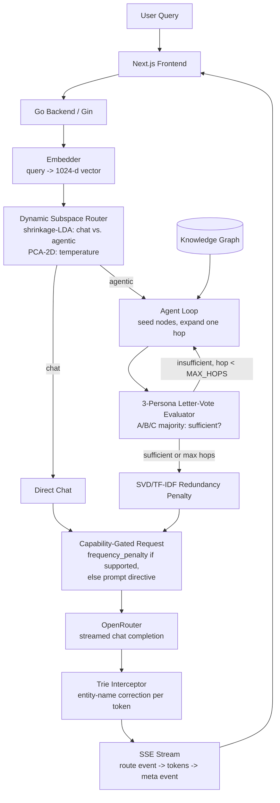
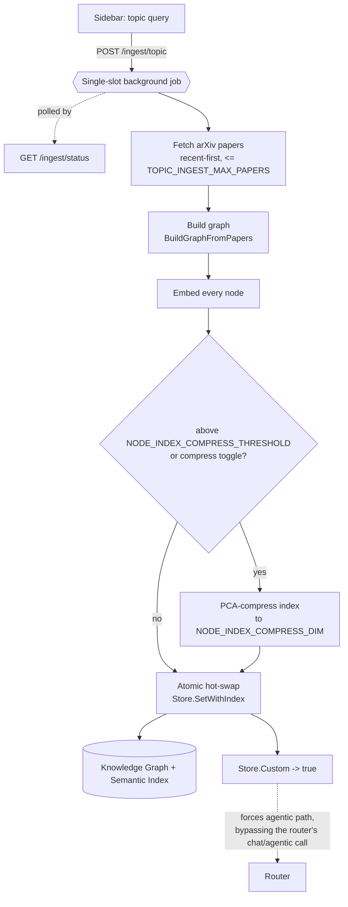

# spectra-rag

> A hybrid GraphRAG system for small free-tier LLMs that **detects which sampling controls each model exposes, uses the native control when it's there, reconstructs the missing ones in application code, and measures whether each one actually helps.**

[](https://github.com/navy1999/spectra-rag/actions/workflows/ci.yml)
[](https://go.dev)
[](https://nextjs.org)
[](https://openrouter.ai)
[](LICENSE)

Free LLM endpoints expose an **inconsistent** subset of sampling controls: some models accept `frequency_penalty`, `top_p`, and `presence_penalty`; few accept `logit_bias`; almost none return `logprobs`. spectra-rag reads each model's `supported_parameters` from OpenRouter, **sends the native control where it exists**, and **reconstructs the rest in application code**, then runs a battery of honest evaluations to find out which of these controls measurably improves a small model's answers and which don't.

The headline results, all measured (see [Evaluation](#evaluation)):

- **Routing works.** A supervised shrinkage-LDA classifier routes chat-vs-agentic at **97.5% leave-one-out**, permutation-confirmed (shuffled labels collapse to ~49%, p = 0.024), decisively beating length (52%) and keyword (65%) baselines.
- **Retrieval works, conditionally.** On out-of-distribution questions, the graph-RAG pipeline beats the bare model **87.5% of the time** (21/24 decisive, 95% CI 69–96%) in a blind, position-controlled LLM-as-judge eval, driven by retrieval grounding rather than the synthesis layers.
- **Two of the four control surfaces are honestly *inactive* on clean graph-RAG**, and the README says so. That negative result, found and reported rather than buried, is the point.

The stack is Next.js → Go/Gin → an optional C++/Eigen PCA engine over cgo, with GraphRAG-style multi-hop retrieval over a JSON knowledge graph. The shipped graph is one arXiv slice, but it's also user-swappable at runtime: type a topic in the sidebar and the backend builds a fresh graph from arXiv on the fly (see [v3](#v3--bring-your-own-corpus-topic-ingestion--compression)).

## Architecture



## The four control surfaces

Each one substitutes for an LLM sampling control, or drives it directly when the model supports one. The honest status of each is the interesting part:

| # | Surface | Native param | Status (measured) | File |
|---|---------|-------------|-------------------|------|
| 1 | **Dynamic Subspace Router**: a supervised shrinkage-LDA boundary over the query embedding decides chat-vs-agentic; a PCA-2D projection sets temperature and drives the visualization. | temperature + routing policy | **Real win.** 97.5% LOO, permutation-confirmed. | [`router/pca_router.go`](backend/router/pca_router.go), [`router/lda.go`](backend/router/lda.go) |
| 2 | **Trie Stream Interceptor**: rewrites near-miss entity names (Levenshtein) to canonical graph spellings. | `logit_bias` (rarely supported) | **Justified workaround**, but a *conditional* safety net: it only fires when the model misspells, and is near-zero on clean graph-RAG. | [`trie/interceptor.go`](backend/trie/interceptor.go) |
| 3 | **SVD Redundancy Penalty**: TF-IDF + SVD over retrieved context yields a redundancy scalar. | `frequency_penalty` (**widely supported**) | **Defers to the native param** when the model accepts it (most do); prompt-directive fallback otherwise. Inactive when context isn't redundant, which graph chunks usually aren't. | [`synthesis/synthesizer.go`](backend/synthesis/synthesizer.go) |
| 4 | **Letter-Vote Evaluator**: three personas at different temperatures vote A/B/C (`max_tokens=1`) to gate each retrieval hop. | `logprobs` (rarely supported) | **Justified workaround** (a confidence signal without logprobs). | [`agent/evaluator.go`](backend/agent/evaluator.go) |

## Capability-aware sampling

The backend fetches each model's `supported_parameters` at startup ([`llmcaps`](backend/llmcaps/caps.go)) and gates the request body, so a user-picked model never receives a parameter its provider rejects with a 400, and so the SVD redundancy scalar is sent as a **real `frequency_penalty`** when possible. Verified support for the models this project uses:

| Model | `frequency_penalty` | `logit_bias` | `logprobs` | Implication |
|---|:---:|:---:|:---:|---|
| `liquid/lfm-2.5-1.2b-instruct:free` | ✅ | ❌ | ❌ | A3 → native param; A2/A4 justified |
| `nex-agi/nex-n2-pro:free` | ✅ | ❌ | ✅ | A3 → native param; A4 could use real logprobs |
| `openai/gpt-oss-20b:free` | ✅ (most providers) | ⚠️ 7/15 | ⚠️ 2/15 | per-provider; gating handles it |

Only the two knobs with an earned signal are set: `temperature` (router) and `frequency_penalty` (A3). `top_p`/`presence_penalty` are left at the provider default rather than shipping arbitrary constants.

## Evaluation

The project's value isn't asserted, it's measured: judge-free string metrics, leave-one-out cross-validation with permutation tests, and a blind LLM-as-judge harness, including the results that came back negative.

### A1: Routing (judge-free, cross-validated)

Does the router's chat-vs-agentic decision beat trivial baselines? The deployed decision is a **raw shrinkage-LDA** (Ledoit-Wolf covariance) boundary `w·x + b` over the 1024-d query embedding.

| Router | Accuracy | Notes |
|---|---|---|
| **shrinkage-LDA (raw 1024-d)** (*deployed*) | **97.5% LOO** | permutation-confirmed: shuffled-label LOO mean 49.1% / max 67.5%, p = 0.024 |
| cosine to class means | 85% LOO | simple, also permutation-confirmed |
| PCA(16)→LDA (2D, used for visualization) | 85% LOO | the 2D projection driving the map + temperature |
| `hit_count` / `length` baselines | 65% / 52% | keyword / query-length one-liners |

The permutation test is the key rigor check: shuffling the labels collapses accuracy to chance, so the 97.5% is genuine separation, not overfitting. **Honest caveat:** it's 40 author-written queries, so this rules out *noise*, not *authorship bias*; an independent held-out set is the next step. The path that got here (an early *negative* result, where unsupervised PCA lost to a length heuristic because the dataset was secretly length-separable, followed by a dataset rebuild and supervised fix) is documented in the git history and is worth more than a cherry-picked number.

```bash
cd backend && EMBEDDINGS_API_KEY=jina_... go run ./cmd/routeeval   # vs length/hit_count baselines
python scripts/fit_lda.py --embeddings data/routing_embeddings.json # refit + export lda_router.json
```

### A2/A3: Synthesis layers (Phase 1, judge-free string metrics)

A controlled ablation runs one model under `raw` / `rag_plain` / `rag_spectra`, holding model + retrieved context fixed so the only variable is the spectra layers. Metrics are judge-free (no LLM grading an LLM): entity exact-spelling, near-miss rate, distinct-2 repetition, groundedness ([`data/eval_results.md`](data/eval_results.md)).

The finding is honest: **the synthesis layers move their target metrics only slightly, and only when they fire.** On a corpus of famous in-distribution entities the trie makes ~1 correction (the model already spells them right) and the redundancy directive rarely triggers (graph chunks aren't repetitive). They are *conditional safety mechanisms*, not unconditional quality boosters.

```bash
cd backend && OPENROUTER_API_KEY=sk-or-... go run ./cmd/eval
```

### Phase 2: End-to-end answer quality (blind LLM-as-judge)

Does the whole pipeline produce *better answers*? A blind, position-bias-controlled pairwise judge ([`cmd/qualityeval`](backend/cmd/qualityeval)) compares two answers per question: judge ≠ generator (no self-grading), both A/B orderings (a side scores only if it wins consistently), Wilson 95% CIs.

On **30 out-of-distribution questions** (obscure recent arXiv papers a small model has not memorized), generator `liquid/lfm-2.5-1.2b-instruct:free`, judge `openai/gpt-oss-120b:free`:

| Comparison | ON wins | OFF wins | Tie | ON win-rate (decisive) |
|---|:---:|:---:|:---:|---|
| **full RAG vs bare model** | 21 | 3 | 6 | **87.5% (95% CI 69–96%)** |
| ↳ authorship questions | 14 | 0 | 1 | 100% |
| ↳ contribution questions | 7 | 3 | 5 | 70% |
| spectra layers (A2+A3) on vs off | 0 | 0 | all | **byte-identical** |

**Two honest conclusions.** (1) Graph-RAG substantially improves answers on entities the model can't know, both by supplying facts *and* by suppressing confident fabrication (the bare model invents author lists; the grounded model defers). (2) The A2/A3 synthesis layers produce **byte-identical** output on this path: they don't activate when the model copies correct names from context and the context isn't redundant. The 87.5% win is **retrieval**, not the synthesis surfaces, and the report is labeled accordingly.

### v3 — Bring-your-own-corpus (topic ingestion + compression)

The shipped graph is a fixed arXiv slice. v3 lets you swap in a *different* one at runtime: type a research area in the sidebar, and the backend

1. fetches a bounded, recent-first set of arXiv papers (`POST /ingest/topic`, default ≤60 papers, `TOPIC_INGEST_MAX_PAPERS`),
2. builds a graph from them (`retrieval.BuildGraphFromPapers`, a Go port of `scripts/build_graph.py`),
3. embeds every node and, for graphs above `NODE_INDEX_COMPRESS_THRESHOLD` (1500 nodes), or via a UI toggle, PCA-compresses the index to `NODE_INDEX_COMPRESS_DIM` (128) dimensions,
4. atomically hot-swaps the active graph + semantic index (`Store.SetWithIndex`), no restart.

It's a single-slot background job (`GET /ingest/status` polls progress); state is in-memory and ephemeral by design, since this is a single-tenant demo, not a multi-corpus store. `TOPIC_INGEST_ENABLED=false` turns the endpoint off.

**A real bug this surfaced, and how it's fixed:** the A1 router classifies by *query intent*, not by what corpus is active, so "how do diffusion models work?" reads as a familiar concept and routes to `chat`, which answers from the model's training data and silently ignores a freshly-ingested corpus. Fixed by making `Store.Custom()` (true once any topic has been ingested) force the agentic/retrieval path regardless of the router's intent call, plus a manual **ground** toggle (`force_retrieve`) in the UI for the default graph. The pipeline inspector's new **grounding** indicator (`graph` vs `model memory`) and **Retrieved · N** chunk list make this visible and let you A/B retrieval without LLM-output noise.



The PCA-compression default is backed by a measured tradeoff (recall@10 vs full-dim cosine neighbours over 282 nodes, [`data/compression_curve.md`](data/compression_curve.md)):

| dims (K) | bytes/node | compression | recall@10 (PCA cosine) | recall@10 (whitened / Mahalanobis) |
|---|---|---|---|---|
| 1024 (full) | 4096 | 1× | 1.000 | 1.000 |
| **128** | **512** | **8×** | **0.851** | 0.451 |
| 64 | 256 | 16× | 0.817 | 0.598 |
| 32 | 128 | 32× | 0.721 | 0.620 |

**8× smaller embeddings preserve 85% of exact neighbours** (K=128). A hypothesis that *didn't* survive contact with data: **whitening (= Mahalanobis distance) hurts**. It amplifies low-variance noise axes, collapsing recall to 0.13 by K=256, so compression uses plain cosine in PCA space, not Mahalanobis. The UI's compress toggle lets you compare both at query time via the Retrieved list.

## Pipeline inspector


A panel beside the chat shows, per query: a 2D map of the routing space (regime centroids, where the query landed, the winning centroid); the stage flow (embed → route → retrieve → synthesize → guard → stream) with each stage's values; the exact sampling params sent; and, on the agentic path, the **Retrieved · N** chunk list plus a **grounding** indicator (`graph` vs `model memory`). Values arrive in-band over SSE (a `route` event before the first token, a `meta` event after the last). With `MOCK_LLM=true` the full pipeline runs and only the final answer is synthetic, so the inspector works without any key.

## Quick start (Docker, no API key)

```bash
git clone https://github.com/navy1999/spectra-rag && cd spectra-rag
MOCK_LLM=true docker compose up --build   # open http://localhost:3000
```

`MOCK_LLM=true` runs the real pipeline (embed → route → retrieve → penalty) with a synthetic final answer, so routing/SSE/UI all work without a key.

### With a real model

```bash
OPENROUTER_API_KEY=sk-or-v1-... docker compose up --build
```

Default model `nex-agi/nex-n2-pro:free` (override with `DEFAULT_MODEL`). Free models churn and are rate-limited upstream, so the backend falls through `FALLBACK_MODELS` on a 429.

## Local development & testing

```bash
# Backend (go.mod in backend/)
cd backend
go run .                    # real output (set keys); MOCK_LLM=true for synthetic
go test ./...               # unit tests across all packages (no key needed)
go vet ./... && gofmt -l .  # CI gates on both

# Frontend
cd frontend && npm install && cp .env.local.example .env.local && npm run dev
```

CI (`.github/workflows/ci.yml`) runs the Go suite with `-race`, the Next.js build, and the C++ `ctest` on every push/PR.

## Making the router real (embeddings + fitted model)

The router carries a real signal only with **real embeddings** projected through a **fitted model**. OpenRouter does not serve embeddings; Jina's free tier is the default.

```bash
# 1. embeddings
EMBEDDINGS_API_KEY=jina_... EMBEDDINGS_MODEL=jina-embeddings-v3 EMBEDDINGS_TASK=classification

# 2. fit + export the routers (no key needed; reuses precomputed embeddings)
cd backend && EMBEDDINGS_API_KEY=jina_... go run ./cmd/embeddump \
  -task classification -in ../data/routing_questions.json -out ../data/routing_embeddings.json
cd .. && python scripts/fit_lda.py --embeddings data/routing_embeddings.json
#   writes data/lda_router.json (raw shrinkage-LDA, the deployed decision)
#        + data/lda_model.json / lda_centroids.json (PCA-2D for temperature + viz)

# 3. node embeddings for semantic seed retrieval (same task as the backend)
EMBEDDINGS_API_KEY=jina_... EMBEDDINGS_TASK=classification python scripts/embed_nodes.py
```

The deployed backend loads `data/lda_router.json` (overrides the path decision) and `data/node_embeddings.json` (semantic seeding); both degrade gracefully if absent. Projection is a pure-Go `components·(x−mean)` matvec, so no cgo is required (`CGO_ENABLED=0`, the Railway default). The C++/Eigen engine (`go build -tags cgo_pca`) is an optional fast path.

## Bring your own graph

The corpus is pluggable two ways. The shipped graph is one arXiv slice, not the only one.

**1. Upload a graph directly.** Schema ([`data/graph.example.json`](data/graph.example.json)) is a flat `{nodes, edges}` document with freeform node `type`, so you can model any domain.

```bash
# at startup
GRAPH_PATH=/path/to/my-graph.json go run .
# at runtime (bearer-gated; disabled unless INGEST_TOKEN is set)
INGEST_TOKEN=secret go run .
curl -X POST localhost:8080/ingest -H "Authorization: Bearer secret" --data @my-graph.json
```

**2. Build one from an arXiv topic.** The sidebar's topic box (or `POST /ingest/topic {"query": "diffusion models"}`) fetches papers, builds the graph, embeds the nodes, and hot-swaps it in (see [v3](#v3--bring-your-own-corpus-topic-ingestion--compression) above). `TOPIC_INGEST_ENABLED=false` disables it.

`GET /graph` reports active node/edge counts plus whether the active graph is custom (`custom`, `label`). Validation rejects empty/duplicate ids, empty names, and dangling edges. Hot-swaps are in-memory and ephemeral; a restart returns to `GRAPH_PATH`.

## Deployment

Frontend and backend deploy separately; the browser talks only to the Next.js app, whose `/api/chat` route proxies to the Go backend.

- **Backend:** [`railway.json`](railway.json) builds [`docker/Dockerfile.backend`](docker/Dockerfile.backend) (pure-Go image, `/health` check). Set `OPENROUTER_API_KEY`, `EMBEDDINGS_API_KEY`, optionally `DEFAULT_MODEL` / `INGEST_TOKEN`.
- **Frontend:** standard Next.js (`output: "standalone"`); on Vercel set root to `frontend/` and `BACKEND_URL` to the backend URL.

Expose the backend to browsers directly only with `CORS_ALLOWED_ORIGINS` set; `localhost`, `*.vercel.app`, `*.up.railway.app`, `*.onrender.com` are allowed by default.

## Design notes & limitations

- **Demonstrator, not production.** Boots with no dependencies (`data/graph.json` at startup); Python, a database, and the C++ build are all optional.
- **Honest about scope.** Two of the four control surfaces (A2, A3) are conditional safety mechanisms that don't activate on clean graph-RAG; the routing win (A1) and the retrieval win are the load-bearing results. Routing accuracy is *not* a claim about answer quality; those are measured separately.
- **Bounded corpus.** Retrieval quality is bounded by the graph; the shipped default graph is author-heavy, so cross-paper reasoning rests mainly on shared topics. The v3 topic-ingestion flow (above) lets you swap in a denser, topic-specific graph at runtime, but each ingestion is still capped at `TOPIC_INGEST_MAX_PAPERS` (60) papers, so very broad fields will still be partial.
- **Small-N evals.** The routing and judge results are on tens of questions with measured CIs; treat them as directional, and the author-written sets carry a distribution caveat.
